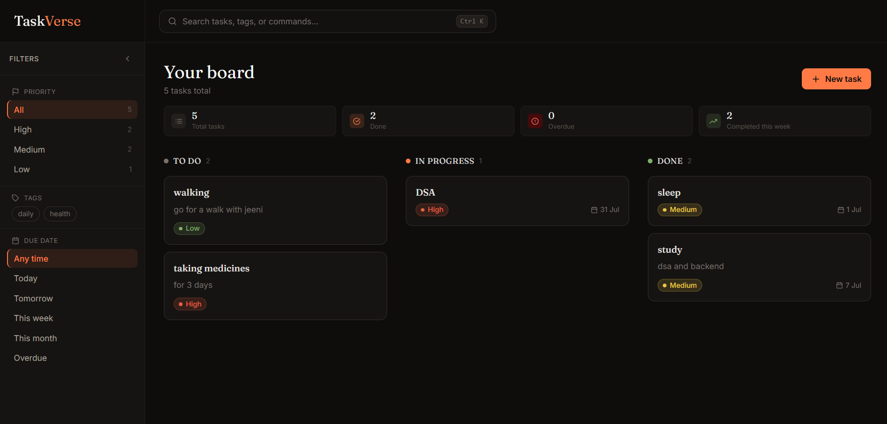

# ✨ TaskVerse

> **A premium full-stack MERN Kanban task manager featuring a modern editorial dark theme, drag-and-drop workflow, command palette, and real-time analytics.**

<p align="center">


</p>

<p align="center">
🌐 <a href="https://taskverse-tau.vercel.app">Live Demo</a> •
⚡ <a href="https://taskverse-api.onrender.com">API</a>
</p>

---

## 📸 Screenshots

### 🏠 Dashboard



---

## 🚀 Features

### ✅ Core
- 📋 Full CRUD task management
- 🎯 Drag-and-drop Kanban board
- ⚡ Optimistic UI updates with automatic rollback
- 🛡 Frontend & backend validation
- 📱 Fully responsive design
- 🌐 RESTful API with Express & MongoDB

### ✨ Advanced
- 🔍 Command Palette (`Ctrl/Cmd + K`)
- 📊 Live analytics dashboard
- 🏷 Filter by priority, tags & due date
- ↕ Sort by priority, due date & creation date
- 🔥 Toast notifications
- 🎨 Custom editorial dark UI
- 🧩 Reusable component library

---

## 🛠 Tech Stack

**Frontend**
- ⚛ React (Vite)
- 🎨 Tailwind CSS
- 🎬 Framer Motion
- 🧩 @dnd-kit
- 📝 React Hook Form + Zod
- 🔥 React Hot Toast
- 🌐 Axios

**Backend**
- 🟢 Node.js + Express
- 🍃 MongoDB + Mongoose
- 📊 MongoDB Aggregation Pipeline

**Deployment**
- ▲ Vercel
- 🚀 Render
- 🍃 MongoDB Atlas

---

## 📂 Project Structure

```text
taskverse/
├── client/
│   ├── components/
│   ├── hooks/
│   ├── services/
│   ├── schemas/
│   └── utils/
│
├── server/
│   ├── config/
│   ├── controllers/
│   ├── models/
│   └── routes/
│
└── README.md
```

---

## ⚙️ Getting Started

### 1️⃣ Clone the repository

```bash
git clone https://github.com/<your-username>/taskverse.git
cd taskverse
```

### 2️⃣ Backend

```bash
cd server
npm install
```

Create a `.env` file:

```env
MONGO_URI=your_mongodb_connection_string
PORT=5000
```

Run the backend:

```bash
npm run dev
```

### 3️⃣ Frontend

```bash
cd ../client
npm install
```

Create a `.env` file:

```env
VITE_API_URL=http://localhost:5000/api
```

Run the frontend:

```bash
npm run dev
```

The app will be available at **http://localhost:5173**

---

## 📡 API Endpoints

| Method | Endpoint | Description |
|--------|----------|-------------|
| GET | `/api/tasks` | Get all tasks |
| GET | `/api/tasks/:id` | Get a task |
| POST | `/api/tasks` | Create task |
| PUT | `/api/tasks/:id` | Update task |
| DELETE | `/api/tasks/:id` | Delete task |
| PATCH | `/api/tasks/reorder` | Reorder tasks |
| GET | `/api/tasks/analytics` | Get analytics |

---

## 💡 Design Highlights

- 🎨 Premium editorial dark theme with **Fraunces + Inter** typography
- ⚡ Optimistic updates for a fast, seamless experience
- 📊 Server-side analytics powered by MongoDB Aggregation Pipeline
- 🧩 Custom-built reusable UI components instead of a UI library

---

## 👨‍💻 Author

**Tanya**  
🎓 B.Tech CSE, KIET Group of Institutions

---

<p align="center">
Built with ❤️ using the MERN Stack
</p>